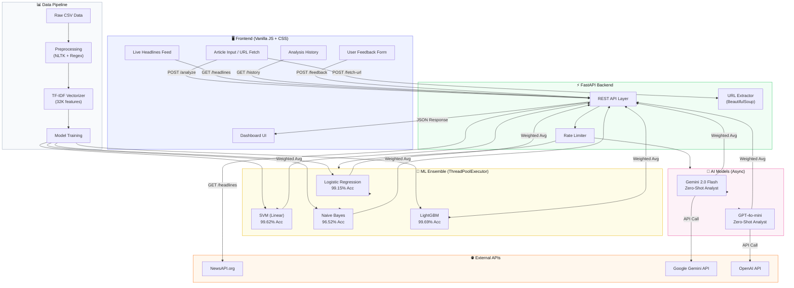
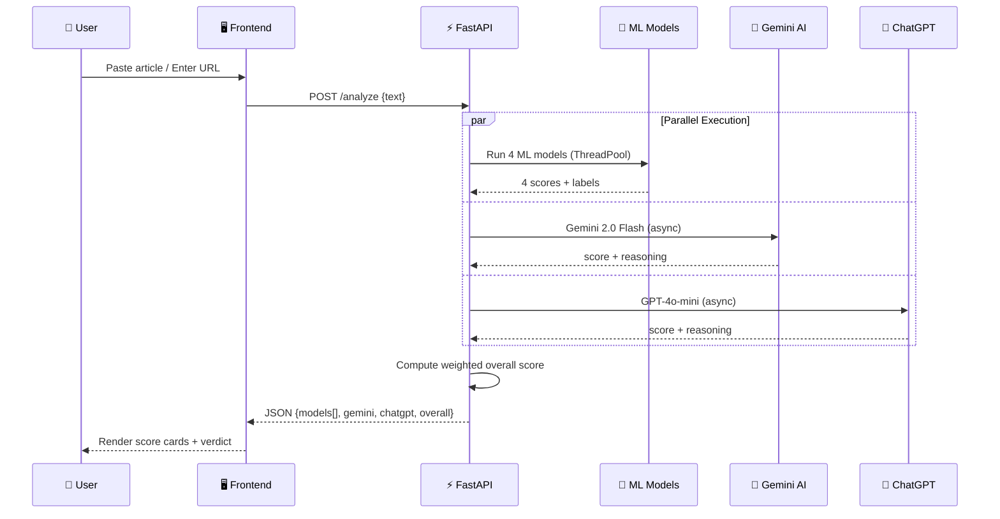
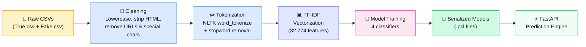

<p align="center">
  
  
  
  
  
  
</p>

# 🛡️ TrustMeBro — Multi-Model Fake News Credibility Analyzer

> **A next-generation news credibility analysis platform that combines 4 classical ML models + 2 AI models (Gemini & ChatGPT) to deliver real-time, multi-faceted verdicts on news articles.**

TrustMeBro runs all 6 signals **in parallel** with a single click, aggregates results into an overall credibility score, and presents them through a polished, responsive dashboard — complete with live news headlines, analysis history, user feedback, and an admin panel.

---

## 📑 Table of Contents

- [System Architecture](#-system-architecture)
- [Features](#-features)
- [Tech Stack](#-tech-stack)
- [Model Performance](#-model-performance)
- [Getting Started](#-getting-started)
- [API Reference](#-api-reference)
- [Project Structure](#-project-structure)
- [Data Pipeline](#-data-pipeline)
- [Testing](#-testing)
- [Screenshots](#-screenshots)
- [Future Roadmap](#-future-roadmap)

---

## 🏗️ System Architecture



### Request Flow



---

## ✨ Features

### 🔍 Parallel Ensemble Analysis
One click triggers **6 independent signals** simultaneously:
- **4 Classical ML Models** — Logistic Regression, SVM, Naive Bayes, LightGBM
- **2 AI Models** — Google Gemini 2.0 Flash & OpenAI GPT-4o-mini
- Results are weighted and aggregated into a single **0-100 credibility score**

### 🗞️ Live Headlines Feed
- Real-time top headlines from **NewsAPI** with **7 category filters** (Top Stories, Tech, Business, Science, Health, Sports, Entertainment)
- **Click-to-analyze**: Click any headline → article is auto-fetched → auto-analyzed
- **10-minute caching** to conserve API quota (100 req/day free tier)

### 🌐 Smart URL Extraction
- Paste any news URL → article body is auto-extracted using BeautifulSoup
- Strips ads, navigation, scripts, and boilerplate — keeps only article content

### 📝 Analysis History
- Persistent log of last 50 analyses with timestamps and score badges
- Exportable and clearable from the dashboard

### 👥 User Feedback System
- Users can mark articles as **True** or **Fake** with optional descriptions
- Admin dashboard displays all feedback for model improvement

### 📊 Performance Dashboard
- Real-time accuracy, F1-score, precision, and recall for every model
- Visual performance comparison table

### 🛡️ Robust Error Handling
- API key validation before making calls
- Automatic retry with backoff on 429/quota errors
- Friendly error messages for quota exhaustion and invalid keys
- Rate limiting aligned with actual API free-tier quotas

---

## 🧰 Tech Stack

| Layer | Technology | Purpose |
|-------|-----------|---------|
| **Backend** | FastAPI, Uvicorn, asyncio | REST API, async request handling |
| **ML Models** | scikit-learn, LightGBM | Text classification (TF-IDF → classifiers) |
| **NLP** | NLTK, Regex | Text preprocessing, tokenization, stopwords |
| **AI** | Google Gemini 2.0 Flash | Zero-shot credibility reasoning |
| **AI** | OpenAI GPT-4o-mini | Zero-shot credibility reasoning |
| **Data** |  Pandas, NumPy | Data manipulation and pipeline |
| **Scraping** | BeautifulSoup4, Requests | URL article extraction |
| **News** | NewsAPI.org | Live headline feed |
| **Frontend** | Vanilla JS (ES6+) | Interactive SPA with no framework overhead |
| **Styling** | Custom CSS | Glassmorphism, animations, responsive grid |
| **Testing** | pytest, TestClient | 25 integration tests |

---

## 📈 Model Performance

All models trained on **23,941 samples** with TF-IDF vectorization (32,774 features).

| Model | Accuracy | Precision | Recall | F1-Score | AUC-ROC |
|-------|----------|-----------|--------|----------|---------|
| **🥇 LightGBM** | **99.69%** | 99.53% | 99.81% | **99.67%** | 99.98% |
| **🥈 SVM** | 99.62% | 99.53% | 99.67% | 99.60% | 99.99% |
| **🥉 Logistic Regression** | 99.15% | 98.86% | 99.37% | 99.12% | 99.95% |
| Naive Bayes | 96.52% | 96.44% | 96.26% | 96.35% | 99.33% |
| Gemini 2.0 Flash | — | — | — | — | — |
| GPT-4o-mini | — | — | — | — | — |

> *AI models provide zero-shot reasoning without fine-tuning. Their scores contribute to the weighted ensemble but don't have traditional ML metrics.*

### Scoring Formula

```
Overall Score = Weighted Average of:
  • ML Models (4x):  credibility_score × weight
  • Gemini AI:        score × weight  (if available)
  • ChatGPT:          score × weight  (if available)
```

---

## 🚀 Getting Started

### Prerequisites

- Python 3.10+
- pip

### Installation

```bash
# 1. Clone the repository
git clone https://github.com/yourusername/TrustMeBro.git
cd TrustMeBro

# 2. Create virtual environment
python -m venv .venv
.venv\Scripts\activate        # Windows
# source .venv/bin/activate   # macOS/Linux

# 3. Install dependencies
pip install -r requirements.txt

# 4. Set up environment variables
#    Create a .env file in the project root:
echo GEMINI_API_KEY=your-gemini-key > .env
echo CHATGPT_API_KEY=your-openai-key >> .env
echo NEWS_API_KEY=your-newsapi-key >> .env
```

### API Key Sources

| Key | Where to Get | Free Tier |
|-----|-------------|-----------|
| `GEMINI_API_KEY` | [Google AI Studio](https://ai.google.dev) | 15 RPM / 1500 RPD |
| `CHATGPT_API_KEY` | [OpenAI Platform](https://platform.openai.com/api-keys) | Pay-as-you-go |
| `NEWS_API_KEY` | [NewsAPI.org](https://newsapi.org/register) | 100 req/day |

### Run the Application

```bash
# Run data pipeline (first time only)
python src/data_pipeline.py

# Train models (first time only)
python src/train.py --models classical

# Start the server
uvicorn api.main:app --reload --port 8000
```

Open **http://localhost:8000** in your browser.

---

## 📡 API Reference

### Core Endpoints

| Method | Endpoint | Description | Auth |
|--------|----------|-------------|------|
| `GET` | `/` | Serve the frontend dashboard | — |
| `POST` | `/analyze` | Run all 6 models on article text | — |
| `POST` | `/predict` | Run a single ML model | — |
| `POST` | `/fetch-url` | Extract article text from a URL | — |
| `GET` | `/headlines` | Fetch live top headlines | — |
| `GET` | `/models` | List available ML models | — |
| `GET` | `/metrics` | View model performance metrics | — |

### Feedback & History

| Method | Endpoint | Description |
|--------|----------|-------------|
| `GET` | `/history` | Get analysis history (last 50) |
| `DELETE` | `/history` | Clear all history |
| `POST` | `/feedback` | Submit user feedback |
| `GET` | `/feedback` | Get all feedback entries |
| `DELETE` | `/feedback` | Clear all feedback |

### Example: Analyze

```bash
curl -X POST http://localhost:8000/analyze \
  -H "Content-Type: application/json" \
  -d '{"text": "Breaking news: Scientists discover new element..."}'
```

**Response:**
```json
{
  "models": [
    {"model_name": "lightgbm", "label": "True", "confidence": 0.97, "credibility_score": 97.3},
    {"model_name": "svm", "label": "True", "confidence": 0.95, "credibility_score": 95.1}
  ],
  "gemini": {"score": 82.0, "reasoning": "Article cites credible sources...", "error": null},
  "chatgpt": {"score": 78.0, "reasoning": "The claims are verifiable...", "error": null},
  "overall_score": 88.5,
  "overall_label": "Likely Credible"
}
```

---

## 📁 Project Structure

```
TrustMeBro/
├── api/
│   └── main.py              # FastAPI app — routes, AI calls, rate limiting
├── src/
│   ├── data_pipeline.py      # CSV preprocessing, text cleaning (NLTK)
│   ├── features.py           # TF-IDF feature extraction
│   ├── predict.py            # Model loading & prediction logic
│   └── train.py              # Train all ML models, save .pkl files
├── models/
│   ├── logistic_regression.pkl
│   ├── svm.pkl
│   ├── naive_bayes.pkl
│   ├── lightgbm.pkl
│   ├── tfidf_vectorizer.pkl
│   └── metrics.json          # Saved performance metrics
├── static/
│   ├── index.html            # Single-page dashboard (SPA)
│   ├── script.js             # Frontend logic — analysis, headlines, feedback
│   └── style.css             # Custom CSS — responsive, animated, themed
├── tests/
│   └── test_api.py           # 25 integration tests (pytest)
├── data/                     # Training datasets (CSV)
├── .env                      # API keys (not committed)
├── requirements.txt          # Python dependencies
└── README.md                 # This file
```

---

## 🔬 Data Pipeline



### Preprocessing Steps

1. **Load** — Read `True.csv` and `Fake.csv`, label them (0/1)
2. **Clean** — Lowercase, remove HTML tags, URLs, emails, special characters
3. **Tokenize** — NLTK `word_tokenize`, remove English stopwords
4. **Vectorize** — Fit TF-IDF vectorizer (max 50,000 features)
5. **Split** — 80/20 train/test stratified split
6. **Train** — Fit 4 classifiers, save models + metrics as `.pkl` and `.json`

---

## 🧪 Testing

```bash
# Run all 25 tests
python -m pytest tests/test_api.py -v

# Example output:
# tests/test_api.py::TestRootEndpoint::test_root_returns_200          PASSED
# tests/test_api.py::TestPredictEndpoint::test_predict_valid_request  PASSED
# tests/test_api.py::TestAnalyzeEndpoint::test_analyze_valid_request  PASSED
# ... 
# ============================== 25 passed in 30.64s ==============================
```

### Test Coverage

| Test Suite | Tests | Coverage |
|-----------|-------|---------|
| Root Endpoint | 2 | HTML serving |
| Predict Endpoint | 4 | Single model predictions, validation |
| Models Endpoint | 3 | Model listing, availability |
| Metrics Endpoint | 3 | Performance data |
| Analyze Endpoint | 3 | Full ensemble analysis |
| History Endpoint | 3 | CRUD operations |
| Feedback Endpoint | 4 | Submit, list, delete |
| Fetch URL Endpoint | 2 | URL validation |
| **Total** | **25** | **All passing ✅** |

---

## 🖼️ Screenshots

### Analyzer View
The main analyzer with URL fetch, text input, and 6-model score cards:
- Paste text or a URL → Click "Analyze with All Models"
- Results show individual model scores + AI reasoning + overall verdict

### Live Headlines
Real-time news feed with 7 category tabs:
- Click any headline to auto-fetch and auto-analyze its credibility

### Dashboard
Performance metrics table showing accuracy, F1, precision, and recall for all trained models.

### Admin Panel
View and manage user feedback submissions for model improvement.

---

## 🛣️ Future Roadmap

- [ ] **Fine-tuned transformer model** — BERT/DistilBERT for improved accuracy
- [ ] **Source credibility database** — Cross-reference article sources with known reliability ratings
- [ ] **Multi-language support** — Analyze articles in languages beyond English
- [ ] **Browser extension** — One-click credibility check from any news website
- [ ] **User accounts** — Personalized history and saved analyses
- [ ] **Retraining pipeline** — Use collected feedback to automatically retrain models
- [ ] **Fact-checking API integration** — Cross-reference claims with fact-check databases

---

## 📄 License

This project is for educational and research purposes.

---

<p align="center">
  <b>Built with ❤️ by the TrustMeBro Team</b><br/>
  <i>Fighting misinformation, one article at a time.</i>
</p>
